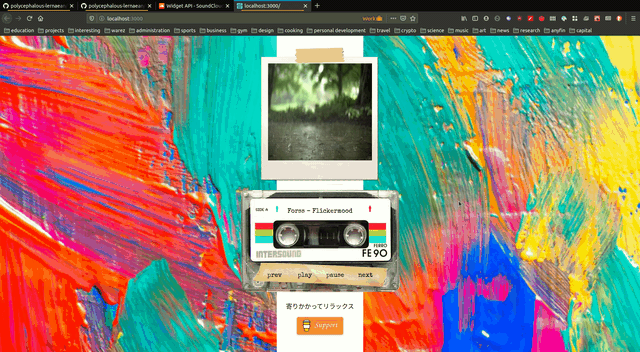

# kassette-radio

A little project that aims to recreate the feeling of early 2000s websites. Includes a slide of gifs + a SoundCloud widget controlled by buttons a taped cassette tape.

## Purpose

To build an early 2000s inspired website in an afternoon. Done entirely for fun. Might host it somewhere later as an alternative to the Youtube playlists that have similar music & aim (meditation / relaxing time), hence the "Buy me a coffee" button.

## Implementation

A small React application done with `create-react-app`. Nothing more nothing less.

## Integrations

Soundcloud Widget - see https://developers.soundcloud.com/docs/api/html5-widget for more details.

## Running

`yarn` to install the necessary `node_modules`, then `yarn start`
